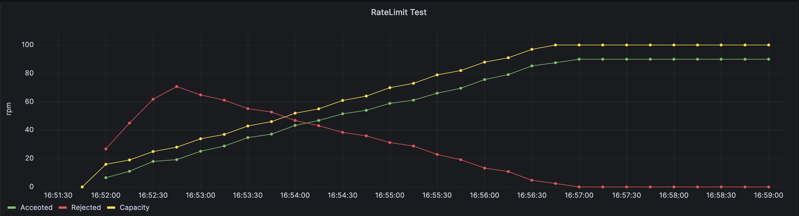
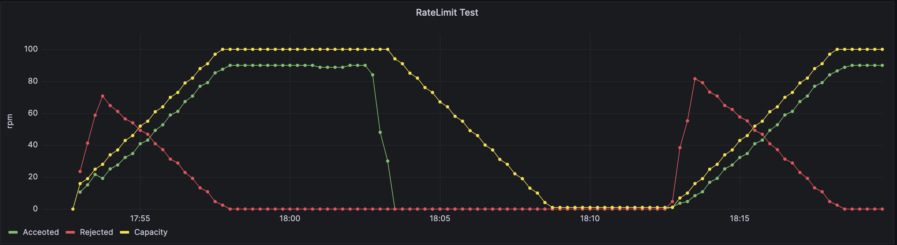

## Rate Limiter

This project implements a rate limiter (useful e.g. for throttling incoming server requests). 

It uses the token-bucket algorithm and includes ramp-up functionality. The rate limiter is instantiated by specifying 2 parameters (its peak requests per minute rate that it will allow and the number of minutes that it should take to smoothly ramp up to that target).

Some test results are included below and some notes on the test setup are included at the bottom.

## Test 1
Because a picture is worth 1000 words, below is a demonstration of how the rate limiter works in a simple test setup:

The rate limiter is set up to process 100 requests per minute at peak, with a ramp-up of 5 minutes:
```
rl, err := ratelimit.NewTokenBucketRateLimiter(100, 5)
```
So its initial capacity will be 10 requests per minute. (10% of max)

Meanwhile, our test application starts firing requests at a constant rate of 90 requests per minute. 
This does not violate our maximum allowed capacity, but we need to enforce the ramp-up, so we gradually start accepting requests over 5 minutes, while rejecting most of the requests initially.

The graph also shows how the capacity grows smoothly over time as a result of high utilization relative to the initial capacity.

## Test 2

The setup here is similar to test 1, except our test application fires requests at the same constant rate for 10 minutes, then sleeps for 10 minutes, then starts again at the same constant rate.



This shows the gradual ramp-down of capacity as a result of lowering demand. And subsequently, smooth ramp-up is again enforced when requests resume at full throttle.

## Notes on local test run

### Install prometheus 

prometheus.yml contains

```
scrape_configs:
- job_name: rate_limit_test
  scrape_interval: 10s
  static_configs:
  - targets:
    - localhost:2112
```

```
brew install prometheus
cp  prometheus.yml /opt/homebrew/etc/prometheus.yml
brew services start prometheus
```

And go to http://localhost:9090/ where you can run queries.

### Install Grafana

```
brew install grafana
brew services start grafana
```

And go to localhost:3000 to log in.

Add your first data source: Prometheus type. Name "Prometheus". Url is localhost:9090 -> Save and test.

Then back to localhost:3000 -> Create a new dashboard